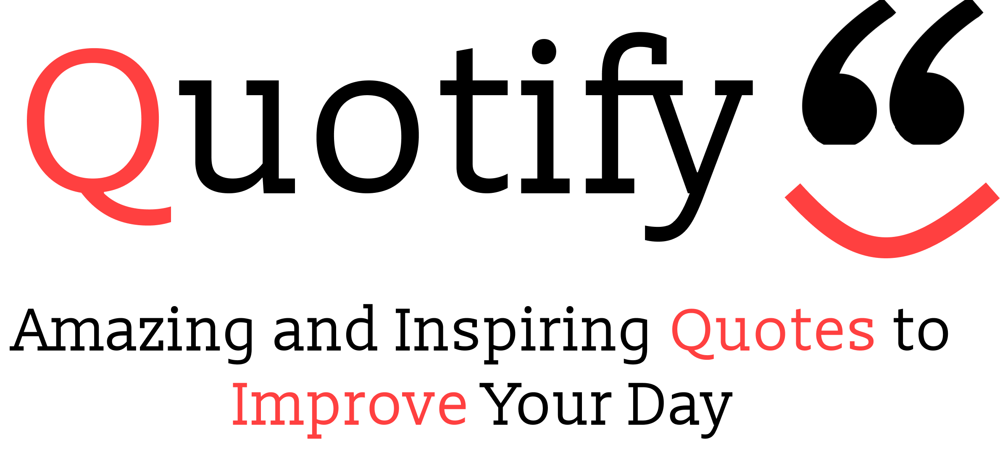

 

  

  

  <b>
    <a href="https://quotifymyworld.netlify.app/">Website</a>
  </b>
  <b>·</b>
  <b>
  <a href="https://hacknroll2021.devpost.com/">Devpost</a>
  </b>
  

## About
Quotify helps you turn your words into inspiration by using Machine Learning to generate quotes! Simply enter a starting phrase and quotify will turn it into a compelling and inspiring quote. 

## Deployment
Deployed on [Netlify](https://www.netlify.com/)

## Built With
* [Axios](https://www.axios.com/)
* [Create-React-App](https://reactjs.org/docs/create-a-new-react-app.html#create-react-app)
* [Docker](https://www.docker.com/)
* [FastAPI](https://fastapi.tiangolo.com/)
* [Hugging Face Transformers](https://huggingface.co/transformers/)
* [Material UI](https://material-ui.com/)
* [PyTorch](https://pytorch.org/)
* [ReactJS](https://reactjs.org/)

## Team
* [Anikesh Bhuvaneshwaram](https://github.com/Anikesh99)
* [Noel Mathew Isaac](https://github.com/noelmathewisaac)
* [Shreyas Kumar](https://github.com/shreytheshreyas)

