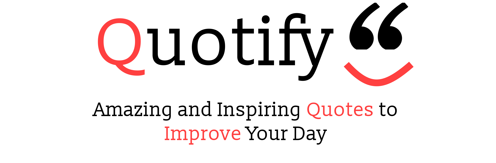

 

  

  

   
   
  Submission for <a href="https://hacknroll2021.devpost.com/">Hack&Roll 2021</a>
     
     
  <b>
    <a href="https://quotifymyworld.netlify.app/">Website</a>
  </b>
  <b>·</b>
  <b>
  <a href="https://devpost.com/software/quotify-0w9k14#updates">Devpost</a>
  </b>
  

## About
Quotify helps you turn your words into inspiration by using Machine Learning to generate quotes! Simply enter a starting phrase and quotify will turn it into a compelling and inspiring quote. 

The model was trained by finetuning GPT2 (a state-of-the-art language model) on a quotes dataset. A list of quotes which were inspiring or motivating were compiled and used from this dataset. By doing GPT's ability to generate English text was tuned to generate quotes (tranfer learning). 

The code for the model training can be found [here](https://github.com/Quotify-Bot/model-training). 

The model was deployed using [Docker](https://www.docker.com/) and [FastAPI](https://fastapi.tiangolo.com/). The code can be found [here](https://github.com/Quotify-Bot/quotify-backend).

## Inspiring Quotes
Some of the inspiring quotes that were generated by the model:
> #### **"Life is like travelling through time so stop being afraid of taking a chance and start appreciating where you are in life."**
 

> #### **"Motivation often comes from internalizing the things we fear. if you can resist that, it will only come back to haunt or rob you of what you really want in life."**
 

> #### **"In the end, it is necessary to discover your inner beauty and truth."**

## Deployment
Deployed on [Netlify](https://www.netlify.com/)

## Built With
* [Axios](https://www.axios.com/)
* [Create-React-App](https://reactjs.org/docs/create-a-new-react-app.html#create-react-app)
* [Docker](https://www.docker.com/)
* [FastAPI](https://fastapi.tiangolo.com/)
* [Hugging Face Transformers](https://huggingface.co/transformers/)
* [Material UI](https://material-ui.com/)
* [PyTorch](https://pytorch.org/)
* [ReactJS](https://reactjs.org/)
* [Unsplash API](https://unsplash.com/developers)

## Team
* [Anikesh Bhuvaneshwaram](https://github.com/Anikesh99)
* [Noel Mathew Isaac](https://github.com/noelmathewisaac)
* [Shreyas Kumar](https://github.com/shreytheshreyas)

